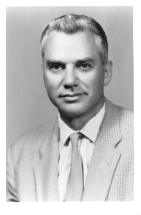

# Discrete Time Processes, Martingales

We are now interested in "time" dependent random outcomes.
In this chapter we consider discrete time, that is an ordered countable index.
This could be anything from a finite set $\{0, 1, \ldots, T\}$ or at the other extreme $\mathbb{Q}$.
We will however generically consider $\mathbb{N}_0$ as the standard index for time and denote different times by $s$ or $t$.
The results in this chapter all holds for any countable ordered set.
In the case where a specific different index shall be considered we will precise it.

Throughout we fix a probability space $(\Omega, \mathcal{F}, P)$.

* [Discrete Time Processes](041-discrete-time-processes.md) (filtration, adapted processes, stopping times.)
* [Martingales](042-martingale-doob.md) (martingale, stochastic integral, doob's optional sampling theorem)
* [Martingales: Almost Sure Convergence](043-martingale-as-convergence.md) (Doob's upcrossing lemma, martingale convergence, Borel-Cantelli)
* [Martingales: $L^p$-convergence](044-martingale-lp-convergence.md) ($L^p$-convergence, law of large numbers)

<!---->
<!---->
<!---->
<!-- !!! note "Joseph L. Doob" -->
<!--      -->
<!--     
 -->
<!--      -->
<!--     - __Joseph L. Doob (1910–2004)__ -->
<!--          -->
<!--         ---- -->
<!--        -->
<!--         Doob played a crucial role in shaping modern probability theory, particularly through his work on stochastic processes. While pioneers like Kolmogorov and Lévy had already laid the foundation for probability as a rigorous mathematical discipline, Doob pushed the field further by developing martingale theory into a powerful analytical framework. His background in complex analysis gave him a unique perspective, allowing him to introduce measure-theoretic precision into probability, bridging gaps between pure and applied mathematics. -->
<!---->
<!--         His most lasting contribution came with his 1953 book Stochastic Processes, where he systematically developed martingale theory, proving fundamental results such as the Doob decomposition and key convergence theorems. These results provided the mathematical backbone for modern stochastic calculus, later becoming essential in areas like financial mathematics, filtering theory, and ergodic theory. By showing how seemingly chaotic processes could be decomposed and analyzed, Doob’s work gave probability a new level of rigor, making it an indispensable tool across various disciplines. -->
<!---->
<!--     -  -->
<!---->
<!--         {align = right} -->
<!--     
 -->
<!---->
<!---->
<!---->
<!---->
